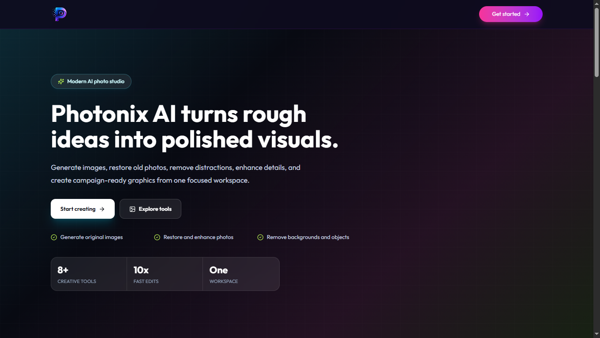
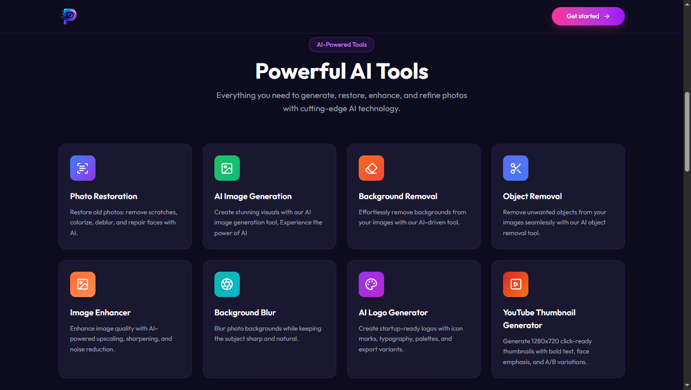

<div align="center">

# ✨ Photonix AI

### AI-Powered Photo Creation and Editing Workspace

A polished full-stack AI image toolkit where users can sign in, generate images, restore photos, remove backgrounds and objects, enhance image quality, blur backgrounds, create logos, and design YouTube thumbnails from one focused workspace.

[](https://photonix-ai.vercel.app/)
[](https://react.dev/)
[](https://vitejs.dev/)
[](https://tailwindcss.com/)
[](https://expressjs.com/)
[](https://photonix-ai.vercel.app/)

</div>

---

## 📸 Preview

<p align="center">
  
</p>

<p align="center">
  
</p>

> **🔗 Live Site:** [https://photonix-ai.vercel.app/](https://photonix-ai.vercel.app/)

---

## ✨ Features

| Feature                            | Description                                                                                         |
| :--------------------------------- | :-------------------------------------------------------------------------------------------------- |
| 🎨 **AI Image Generation**         | Generate polished visuals from text prompts with style, aspect ratio, brand, and variation controls |
| 🧽 **Background Removal**          | Remove image backgrounds with AI-powered upload and processing workflows                            |
| ✂️ **Object Removal**              | Clean unwanted objects from images by describing what should be removed                             |
| 🖼️ **Image Enhancement**           | Improve image quality with sharpening, upscaling, noise reduction, and restoration-focused tools    |
| 🪄 **Photo Restoration**           | Repair old photos by reducing scratches, restoring faces, colorizing, and improving clarity         |
| 📷 **Background Blur**             | Keep the subject sharp while adding a natural blurred-background effect                             |
| 🧩 **Logo Generator**              | Create startup-ready logo concepts with color, typography, icon, and export variant options         |
| ▶️ **YouTube Thumbnail Generator** | Generate 1280x720 thumbnail concepts with strong composition and A/B variations                     |
| 🔐 **Authentication Gate**         | Clerk-powered sign-in protects the AI workspace and user-specific creation history                  |
| 💾 **Creation History**            | User creations are stored in a Neon database and can be viewed from the dashboard                   |
| ☁️ **Cloud Uploads**               | Generated and processed assets are uploaded through Cloudinary for reliable media delivery          |
| 📱 **Responsive UI**               | Built with modern responsive layouts for desktop, tablet, and mobile screens                        |

---

## 🛠️ Tech Stack

<div align="center">

|          Technology           |                                 Purpose                                 |
| :---------------------------: | :---------------------------------------------------------------------: |
|         **React 19**          |                      Component-driven frontend UI                       |
|          **Vite 7**           |        Fast development server and optimized production bundling        |
|      **Tailwind CSS 4**       |               Utility-first styling and responsive design               |
|      **React Router 7**       |                    Public and protected app routing                     |
|           **Clerk**           |               Authentication and user session management                |
|           **Axios**           |                     Client/server API communication                     |
|      **React Hot Toast**      |              Instant user feedback for actions and errors               |
|       **Lucide React**        |              Clean icon system for navigation and controls              |
|         **Express 5**         |                           Backend API server                            |
|      **Neon PostgreSQL**      |               Serverless database for creations and likes               |
|        **Cloudinary**         |           Image upload, storage, and transformation delivery            |
| **Gemini API via OpenAI SDK** | Text and multimodal AI generation through an OpenAI-compatible endpoint |
|       **Clipdrop API**        |    Text-to-image generation used by image, logo, and thumbnail tools    |
|       **Tesseract.js**        |                OCR support for image-to-text processing                 |
|          **Multer**           |            File upload handling for image and document tools            |
|          **Vercel**           |                     Frontend and backend deployment                     |

</div>

---

## 📁 Project Structure

```text
Photonix-AI/
├── client/
│   ├── public/
│   │   ├── favicon.svg
│   │   ├── gradientBackground.png
│   │   ├── logo.png
│   │   ├── preview.png
│   │   └── preview2.png
│   ├── src/
│   │   ├── assets/
│   │   │   ├── assets.js
│   │   │   ├── logo.svg
│   │   │   └── profile_img_1.png
│   │   ├── components/
│   │   │   ├── AiTools.jsx
│   │   │   ├── Footer.jsx
│   │   │   ├── Hero.jsx
│   │   │   ├── Navbar.jsx
│   │   │   ├── Plan.jsx
│   │   │   ├── Sidebar.jsx
│   │   │   └── Testimonial.jsx
│   │   ├── pages/
│   │   │   ├── BackgroundBlur.jsx
│   │   │   ├── Dashboard.jsx
│   │   │   ├── GenerateImages.jsx
│   │   │   ├── ImageEnhancer.jsx
│   │   │   ├── Layout.jsx
│   │   │   ├── LogoGenerator.jsx
│   │   │   ├── PhotoRestoration.jsx
│   │   │   ├── RemoveBackground.jsx
│   │   │   ├── RemoveObject.jsx
│   │   │   └── YoutubeThumbnailGenerator.jsx
│   │   ├── App.jsx
│   │   ├── index.css
│   │   └── main.jsx
│   ├── index.html
│   ├── package.json
│   └── vite.config.js
├── server/
│   ├── config/
│   │   ├── cloudinary.js
│   │   ├── db.js
│   │   ├── initDb.js
│   │   └── multer.js
│   ├── controllers/
│   │   ├── aiController.js
│   │   └── userController.js
│   ├── middlewares/
│   │   └── auth.js
│   ├── routes/
│   │   ├── aiRoutes.js
│   │   └── userRoutes.js
│   ├── package.json
│   └── server.js
├── LICENSE
└── README.md
```

---

## 🎨 Design Highlights

- **Modern dark hero section** with a focused Photonix AI value proposition and clear calls to action
- **Tool-first dashboard** with compact navigation for repeated creative workflows
- **Responsive image-tool forms** with upload states, prompt inputs, and generated result previews
- **Premium visual style** using clean gradients, high-contrast cards, and consistent iconography
- **Authenticated workspace** that keeps public marketing pages separate from protected AI tools
- **Media-first branding** powered by the `client/public/logo.png` asset across navigation and footer

---

## 🔌 API Overview

Backend routes are protected with Clerk authentication and mounted under:

```text
/api/ai
/api/user
```

Main AI endpoints include:

| Endpoint                               | Purpose                                      |
| :------------------------------------- | :------------------------------------------- |
| `POST /api/ai/generate-image`          | Generate images from prompts                 |
| `POST /api/ai/remove-image-background` | Remove or replace image backgrounds          |
| `POST /api/ai/remove-image-object`     | Remove selected objects from uploaded images |
| `POST /api/ai/enhance-image`           | Enhance and upscale uploaded images          |
| `POST /api/ai/restore-photo`           | Restore damaged or old photos                |
| `POST /api/ai/blur-background`         | Apply subject-aware background blur          |
| `POST /api/ai/generate-logo`           | Generate logo concepts                       |
| `POST /api/ai/generate-thumbnail`      | Generate YouTube thumbnail concepts          |
| `GET /api/user/get-user-creations`     | Fetch authenticated user creations           |

---

## 📦 Data and Storage

Photonix AI uses a Neon PostgreSQL `creations` table initialized by the backend on startup. Each creation stores:

- User ID
- Prompt
- Generated content URL or text
- Creation type
- Publish state
- Likes
- Created and updated timestamps

Generated and uploaded images are delivered through Cloudinary.

---

## 🌐 Deployment

The application is deployed on **Vercel**:

**Live URL:** [https://photonix-ai.vercel.app/](https://photonix-ai.vercel.app/)

For deployment, configure the same client and server environment variables in your Vercel project settings.

---

<div align="center">

**⭐ If you found this project useful, consider giving it a star!**

Made with ❤️ using React, Vite, Tailwind CSS, Express, Clerk, Neon, and Cloudinary

</div>
